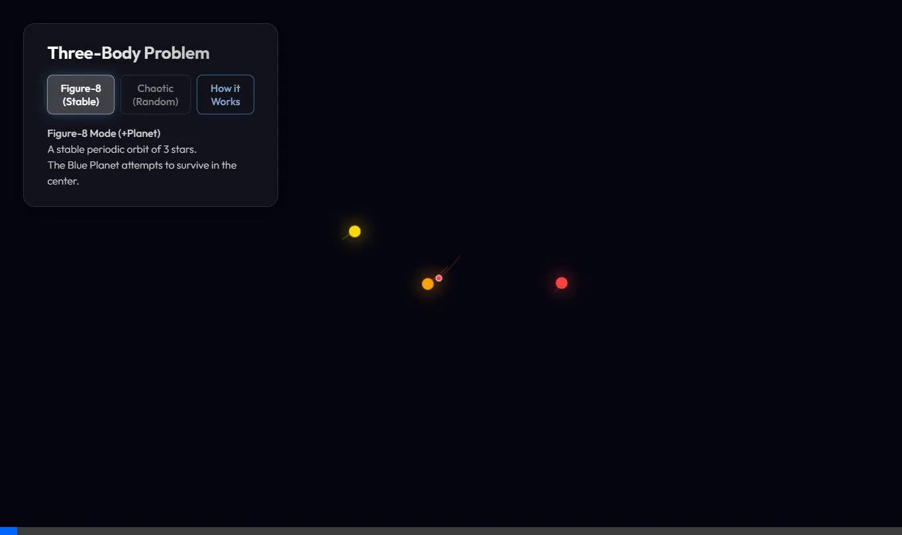

# 삼체 시뮬레이션: 소설 속 '삼체' 환경의 현실성 탐구
# Three-Body Simulation: Exploring the Reality of Trisolaris

🔗 **시뮬레이션 해보기 (Live Demo):** [https://cupfeedback.github.io/threebody-problem-simulation/](https://cupfeedback.github.io/threebody-problem-simulation/)

이 repo는 넷플릭스 드라마 삼체(3 Body Problem)와 원작 소설을 보고, 소설 속에 묘사된 '삼체인들의 환경'이 과연 물리학적으로 구현 가능한지 궁금해서 시작하게 되었습니다.

## 🧪 Antigravity와 함께 탐구한 결과 (Findings with Antigravity)

Antigravity (AI Agent)를 활용해 코드를 작성하고 시뮬레이션을 돌려본 결과, "소설 속의 삼체 환경은 물리적 제약 없이는 거의 구현 불가능하다"는 결론을 얻었습니다.

### 1. 단순 무작위 (Pure Random)의 실패
초기에 `Math.random()`만을 사용하여 위치와 속도를 무작위로 설정했을 때는 소설 같은 환경이 나오지 않았습니다.
*   **코드**: `x = (Math.random() - 0.5) * 2.0`
*   **결과**: 시작하자마자 행성이 강력한 중력 킥(Gravitational Kick)을 받고 우주 저 멀리 튕겨 나갑니다. '난하기'를 겪을 새도 없이 시스템이 붕괴됩니다.

### 2. 구현을 위해 적용한 '3가지 치트키' (Constraints Applied)
소설처럼 "오랫동안 고통받는" 삼체 환경을 만들기 위해 다음과 같은 물리적 제약 조건을 강제로 걸어야 했습니다.

#### A. 깨진 삼각형 (Broken Triangle / Perturbed Lagrange)
완전한 랜덤 대신, 안정적인 상태를 살짝 비틀었습니다.
*   **방법**: 세 개의 태양을 완벽한 정삼각형(라그랑주 궤도)에 배치한 뒤, 약 `0.15` 정도의 랜덤 노이즈(Perturbation)를 추가했습니다.
*   **효과**: 시스템이 바로 붕괴되지 않고, 아주 오랫동안 얽히고설키며 '안정적인 카오스' 상태를 유지합니다.

*(깨진 삼각형 설정으로 구현한 'Bound Chaos' 모드. 별들이 도망가지 않고 뒤엉켜 돕니다)*

#### B. 보이지 않는 중력 벽 (Galaxy Potential / Soft Boundary)
별들이 무한히 멀어지는 것을 막기 위해 인위적인 복원력을 추가했습니다.
*   **방법**: 중심에서 거리 `2.5` 이상 멀어지면, `0.05`의 힘으로 중심 방향으로 살짝 당겼습니다. (마치 은하 중심을 공전하는 것처럼)
*   **효과**: 태양들이 도망가지 못하고 좁은 구역 안에서 계속해서 행성을 괴롭히게 됩니다.

#### C. 제한적 3체 문제 (Restricted Three-Body Problem) & Figure-8
*   **방법**: 행성(Trisolaris)의 질량을 태양 대비 `0.0001` 수준으로 설정하고, 태양의 움직임에 영향을 주지 않도록 계산식에서 제외했습니다.
*   **효과**: 행성은 중력의 파도에 휩쓸리는 '먼지' 같은 존재가 되어, 궤도 예측이 불가능한 '난하기'와 '항하기'를 겪게 됩니다.

*(수학적으로 완벽한 'Figure-8' 궤도. 이 안에서도 행성은 결국 튕겨 나갑니다)*

---

## English Description

This project started from a curiosity after watching the **Netflix series '3 Body Problem'**: **"Is the chaotic environment of Trisolaris actually physically possible?"**

### 🧪 Findings with Antigravity

By testing various simulations with **Antigravity (AI Agent)**, I discovered that **"the specific chaotic environment described in the novel is nearly impossible to reproduce without heavy artificial constraints."**

### 1. The Failure of Pure Randomness
Using simple variables like `Math.random()` results in immediate system failure.
*   **Result**: The planet is almost instantly ejected into deep space due to gravitational slingshots. The "Chaotic Era" described in the book rarely happens naturally.

### 2. The "Cheats" Used for Simulation
To recreate the "eternal suffering" of Trisolaris, specific physical constraints were required:

#### A. Broken Triangle (Perturbed Lagrange)
Instead of starting random, we start stable and break it.
*   **Method**: Initialize stars in a perfect Equilateral Triangle (Lagrange configuration) and add slight random noise (`perturbation ≈ 0.15`).
*   **Effect**: This creates a bound system that degrades into chaos very slowly, allowing for long observation.

#### B. Invisible Gravity Wall (Soft Boundary)
To prevent stars from escaping forever.
*   **Method**: If a star drifts too far (distance > 2.5), a weak restoring force pulls it back to the center.
*   **Effect**: Simulates a galactic potential, forcing the stars to remain in a "Hellishly Bound" dance.

#### C. Restricted Three-Body Problem
*   **Method**: The planet has negligible mass (`0.0001`) and does not affect the stars.
*   **Effect**: The planet becomes a test particle tossed around by the stars, perfectly simulating the unpredictability of the Trisolaran climate.
